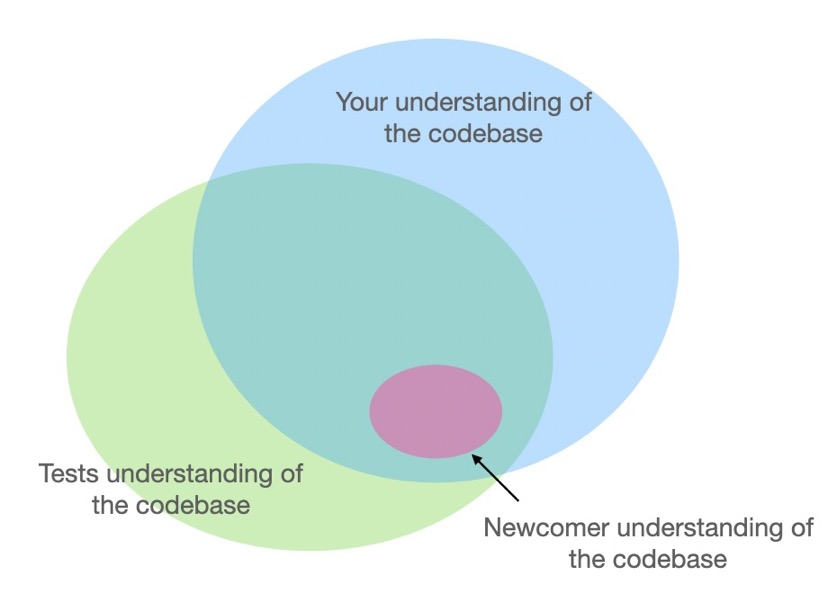
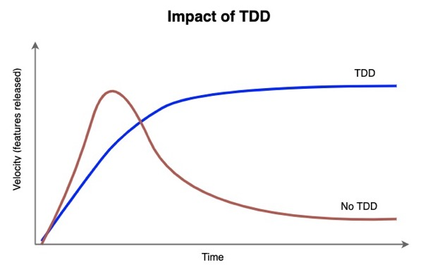
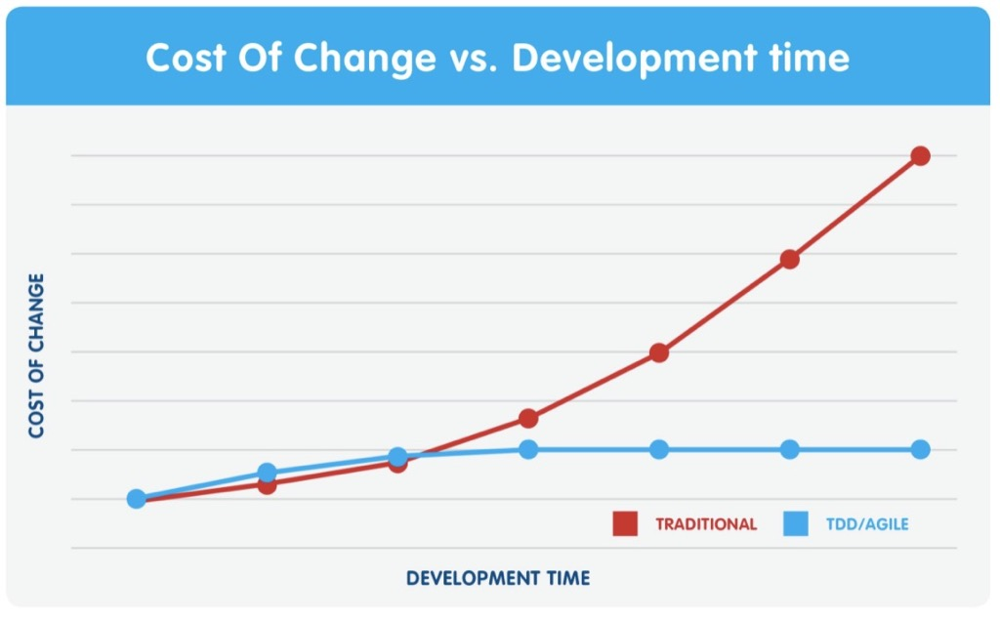
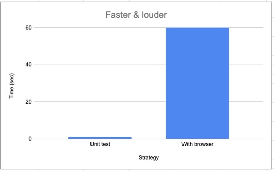
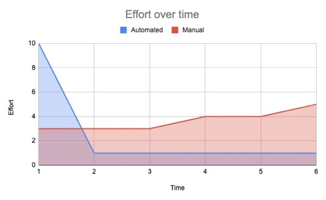

## Benefits of Testing

### What are some benefits of testing?

Take some time to think about...

### Knowledge sharing

### Wrangles complexity

### Wrangles complexity

### Faster feedback loops

### You test anyway

When you're developing, you're testing the behavior
as you go.

Writing tests starts saving you time quickly.

### Less effort over time

### Challenges

What makes testing challenging at Gather?

### Challenges

* False dilemma of speed **vs** tests
* Learning a new tool / framework
* Adopting a new mindset
* Websockets
* Video
* Canvas
